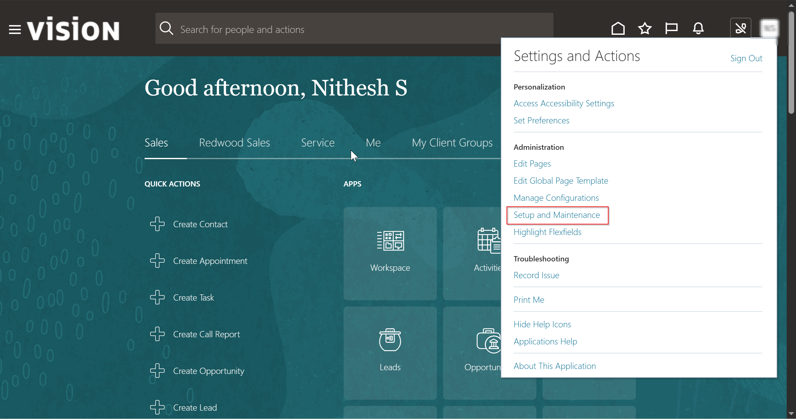

# 🛠 Implementation Project – Aventra Global Holdings

This file documents the creation and setup of the Oracle Fusion HCM implementation project used to configure the Core HR components for Aventra Global Holdings.

---

## 📌 Project Details

- **Project Name**: Aventra Core HR Setup
- **Offering**: Workforce Deployment
- **Status**: Active

---

## ✅ Functional Areas Enabled

| Functional Area         | Enabled | Comments                           |
|------------------------|---------|------------------------------------|
| Global Human Resources | ✅      | Core HR functionality              |
| Payroll Interface      | ✅      | For future integration             |
| Absence Management     | ✅      | Employee leaves and tracking       |
| Workforce Structures   | ✅      | Jobs, Grades, Positions setup      |

---

## 📋 Steps to Create the Implementation Project

1. Click the profile icon and select **Setup and Maintenance**.
   

2. In FSM (Functional Setup Manager), click the **Tasks** button and select **Manage Implementation Project**.
   

3. Click the **Add (+)** button to create a new implementation project. Enter the project details and click **Next**.
   

4. There are two places to select offerings:
   - **During project creation**:
     
   - **After project creation (edit mode)**:
     

5. Make sure to add the **Workforce Deployment** offering so you can begin setting up your enterprise structures.

---

